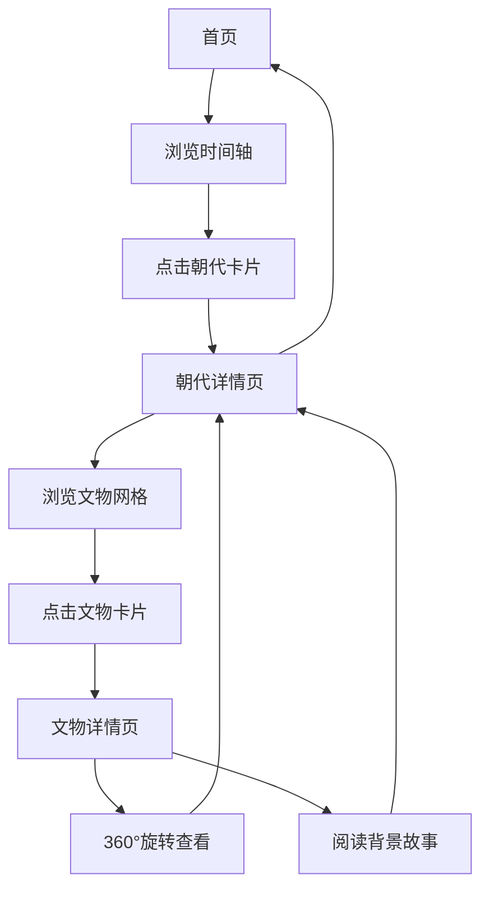

## 1. Product Overview
中国上下五千年全朝代文物展沉浸式数字博物馆，通过3D全息光影技术展示中华文明瑰宝。
- 为用户提供震撼的沉浸式体验，穿越时空感受中国历史的辉煌
- 利用8K超高清画质和电影级氛围感，打造具有东方史诗美学的数字博物馆

## 2. Core Features

### 2.1 User Roles
| Role | Registration Method | Core Permissions |
|------|---------------------|------------------|
| Visitor | No registration required | Browse all exhibitions and 3D artifacts |

### 2.2 Feature Module
1. **首页**: 史诗级英雄区，上下五千年时间轴，朝代概览卡片
2. **朝代详情页**: 3D空间展示，文物网格，全息光影效果
3. **文物详情页**: 360°文物旋转，细节放大，背景故事

### 2.3 Page Details
| Page Name | Module Name | Feature description |
|-----------|-------------|---------------------|
| 首页 | 史诗级英雄区 | 8K超高清背景，动态光影，中国传统色渐变，书法体标题 |
| 首页 | 时间轴导航 | 从夏朝到清朝的时间轴，每个朝代可点击，悬停有特效 |
| 首页 | 朝代概览卡片 | 每个朝代卡片展示标志性文物，3D悬浮效果，点击进入详情 |
| 朝代详情页 | 3D展示空间 | 朝代背景故事，文物网格布局，全息光影环绕 |
| 朝代详情页 | 文物卡片 | 每个文物带缩略图，点击进入详情，悬停放大效果 |
| 文物详情页 | 360°查看器 | 文物3D模型，可拖拽旋转，细节放大，8K超高清展示 |
| 文物详情页 | 全息光影效果 | 文物周围动态光影，东方美学氛围，背景故事介绍 |

## 3. Core Process
1. 用户进入首页，被史诗级英雄区震撼
2. 沿着时间轴浏览，了解中国历史脉络
3. 点击感兴趣的朝代，进入朝代详情页
4. 浏览该朝代的文物，点击心仪文物进入详情
5. 在文物详情页360°欣赏，了解背景故事
6. 返回首页或跳转到其他朝代继续探索

## 4. User Interface Design
### 4.1 Design Style
- 主色调：中国传统朱红(#C41E3A)、金色(#D4AF37)、墨黑(#1A1A1A)
- 次要色调：青花瓷蓝(#2E5090)、玉绿(#7CB342)、宣纸白(#F5F0E6)
- 按钮风格：圆角设计，金色描边，悬停时发光效果
- 字体：标题使用书法风格字体（如楷体、隶书），正文使用优雅的宋体或仿宋
- 布局风格：分层深度设计，不对称布局，东方美学留白
- 视觉效果：全息光影、粒子效果、动态光效、8K画质

### 4.2 Page Design Overview
| Page Name | Module Name | UI Elements |
|-----------|-------------|-------------|
| 首页 | 史诗级英雄区 | 8K超高清背景图，动态光影流动，书法体主标题，粒子效果，渐入动画 |
| 首页 | 时间轴导航 | 横向时间轴，每个朝代节点发光，悬停放大，连线渐变效果 |
| 首页 | 朝代概览卡片 | 3D悬浮卡片，每个朝代独特配色，标志性文物缩略图，悬停时全息投影效果 |
| 朝代详情页 | 3D展示空间 | 朝代名称大标题，背景故事介绍，文物网格，全息光影环绕整个空间 |
| 朝代详情页 | 文物卡片 | 网格布局，文物缩略图，名称和年代，悬停放大并出现光晕 |
| 文物详情页 | 360°查看器 | 中央3D文物模型，可拖拽旋转，鼠标滚轮缩放，细节展示点 |
| 文物详情页 | 全息光影效果 | 文物周围动态光环，粒子环绕，东方美学背景，卷轴式故事介绍 |

### 4.3 Responsiveness
- 桌面端优先设计，完整展示8K超高清和3D效果
- 平板端自适应，简化部分复杂光影效果
- 移动端优化，保持核心浏览功能，降低3D复杂度

### 4.4 3D Scene Guidance
- 环境/HDRI：东方古典美学环境，模拟博物馆展厅或宫殿场景
- 照明设置：主光源金色暖光，环境光柔和，配合动态光影效果
- 相机设置：缓慢自动旋转视角，用户可手动控制，景深效果
- 构图：中央聚焦文物，周围环绕信息和装饰元素
- 交互：拖拽旋转、滚轮缩放、点击查看详情
- 后处理效果：辉光、景深、轻微胶片颗粒，增强电影感
- 资产来源：使用高质量3D模型和纹理，确保性能流畅
