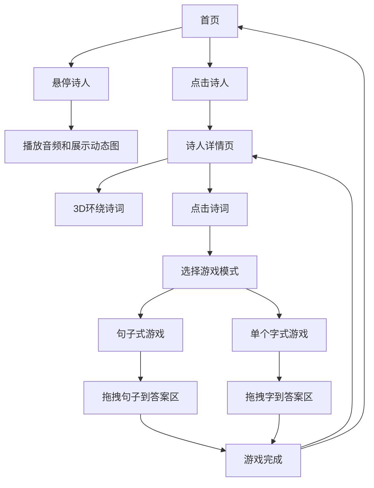

## 1. Product Overview
中小学古诗词在线游戏性学习平台，通过3D沉浸式体验提升学习兴趣和效果。
- 为中小学生提供互动性强、视觉效果丰富的古诗词学习环境
- 目标是让学习古诗词变得有趣，提高学生的学习积极性和记忆效果

## 2. Core Features

### 2.1 User Roles
| Role | Registration Method | Core Permissions |
|------|---------------------|------------------|
| Student | No registration required | Access all learning and game features |

### 2.2 Feature Module
1. **首页**: 诗人列表展示，3D效果，音频预览
2. **诗人详情页**: 诗人信息展示，3D诗词环绕效果
3. **诗词游戏页**: 两种游戏模式（句子式和单个字式）

### 2.3 Page Details
| Page Name | Module Name | Feature description |
|-----------|-------------|---------------------|
| 首页 | 诗人列表 | 展示所有中小学大纲中诗人的名字和朝代，3D效果展示，鼠标悬停时播放音频并展示动态图 |
| 首页 | 交互效果 | 鼠标悬停时提供音频效果（诗人著名诗句），画面由远到近展示诗人动态图 |
| 诗人详情页 | 诗人信息 | 展示诗人基本信息，所有中小学大纲内的诗词成3D围绕诗人动态图缓慢旋转 |
| 诗词游戏页 | 句子式游戏 | 诗词断为句子，在页面上方无规则游动，通过鼠标左键点击拖拽至答案预留区 |
| 诗词游戏页 | 单个字式游戏 | 诗词拆分为单个字，在页面上方无规则游动，通过鼠标左键点击拖拽至答案预留区 |
| 诗词游戏页 | 答题区 | 包括诗词名称，诗人·朝代，答案预留区，正确答案时渲染特效 |

## 3. Core Process
1. 用户进入首页，浏览诗人列表
2. 鼠标悬停在诗人名字上，听到音频并看到诗人动态图
3. 点击诗人名字，进入诗人详情页
4. 在诗人详情页，查看诗人信息和3D环绕的诗词
5. 点击诗词，进入游戏界面
6. 选择游戏模式（句子式或单个字式）
7. 开始游戏，拖拽游动的句子或字到答案区
8. 完成游戏，获得反馈

## 4. User Interface Design
### 4.1 Design Style
- 主色调：中国传统红色(#E53E3E)和金色(#D69E2E)
- 次要色调：淡雅青色(#9AE6B4)和米色(#F7FAFC)
- 按钮风格：圆角设计，3D效果，悬停时有轻微放大效果
- 字体：标题使用书法风格字体，正文使用清晰易读的无衬线字体
- 布局风格：3D场景布局，分层设计，具有深度感
- 图标风格：中国传统风格图标，如毛笔、书卷等元素

### 4.2 Page Design Overview
| Page Name | Module Name | UI Elements |
|-----------|-------------|-------------|
| 首页 | 诗人列表 | 3D空间中排列的诗人卡片，每个卡片包含诗人名字和朝代，悬停时发光效果，背景为淡雅的中国风图案 |
| 首页 | 交互效果 | 鼠标悬停时播放音频，同时诗人动态图从远处逐渐放大至清晰，伴随淡入效果 |
| 诗人详情页 | 诗人信息 | 中央为诗人动态图，周围3D环绕显示该诗人的诗词，背景为诗人所处朝代的风格图案 |
| 诗词游戏页 | 游戏区域 | 上方为游动的句子或字，下方为答题区，包含诗词标题、作者信息和答案预留区，背景为古典卷轴风格 |
| 诗词游戏页 | 游戏反馈 | 正确拖拽时产生金色光芒特效，错误时产生红色闪烁效果 |

### 4.3 Responsiveness
- 桌面端优先设计，支持平板电脑自适应
- 移动端简化3D效果，保持核心功能
- 触摸设备优化，支持触摸拖拽操作

### 4.4 3D Scene Guidance
- 环境/HDRI：使用柔和的室内光照，模拟古代书房环境
- 照明设置：暖色调主光源，辅以柔和的环境光
- 相机设置：动态相机，根据用户交互调整视角
- 构图：中央聚焦元素，周围元素环绕排列
- 交互：鼠标悬停和点击触发动画效果
- 后处理效果：轻微的景深效果，增强3D感
- 资产来源：使用开源的3D模型和纹理，确保性能流畅