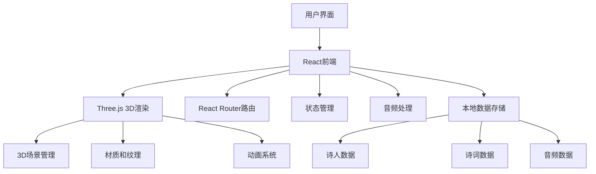
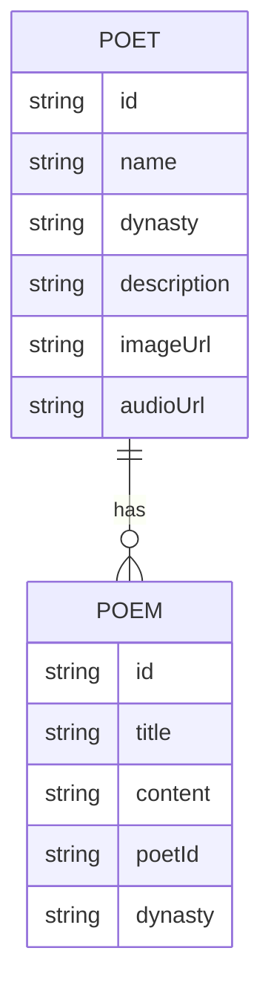

## 1. Architecture Design


## 2. Technology Description
- 前端：React@18 + TypeScript + Tailwind CSS@3 + Vite
- 3D渲染：Three.js + @react-three/fiber + @react-three/drei
- 音频处理：Web Audio API
- 状态管理：Zustand
- 路由：React Router
- 本地存储：localStorage（用于存储游戏进度）
- 构建工具：Vite

## 3. Route Definitions
| Route | Purpose |
|-------|---------|
| / | 首页 - 诗人列表展示 |
| /poet/:id | 诗人详情页 - 展示诗人信息和诗词 |
| /poem/:id | 诗词游戏页 - 游戏界面 |

## 4. Data Model
### 4.1 Data Model Definition


### 4.2 Data Definition
#### 诗人数据结构
```typescript
interface Poet {
  id: string;
  name: string;
  dynasty: string;
  description: string;
  imageUrl: string;
  audioUrl: string;
  famousLines: string[];
}
```

#### 诗词数据结构
```typescript
interface Poem {
  id: string;
  title: string;
  content: string;
  poetId: string;
  dynasty: string;
  sentences: string[];
  characters: string[];
}
```

## 5. 3D Implementation Details
### 5.1 首页3D场景
- 使用Three.js创建3D空间
- 诗人卡片在3D空间中排列
- 鼠标悬停时的缩放和旋转动画
- 音频播放触发

### 5.2 诗人详情页3D场景
- 中央诗人图像
- 诗词环绕旋转效果
- 相机视角跟随用户交互

### 5.3 诗词游戏页3D场景
- 游动的句子或字的动画效果
- 拖拽交互实现
- 正确答案时的特效渲染

## 6. 性能优化策略
- 3D模型和纹理的懒加载
- 音频资源的预加载
- 动画帧率控制
- 响应式设计，根据设备性能调整3D效果复杂度

## 7. 技术实现要点
- 使用React hooks管理3D场景的生命周期
- 使用Zustand管理全局状态
- 使用Tailwind CSS实现响应式布局
- 使用Web Audio API实现音频播放
- 使用@react-three/fiber和@react-three/drei简化Three.js的使用