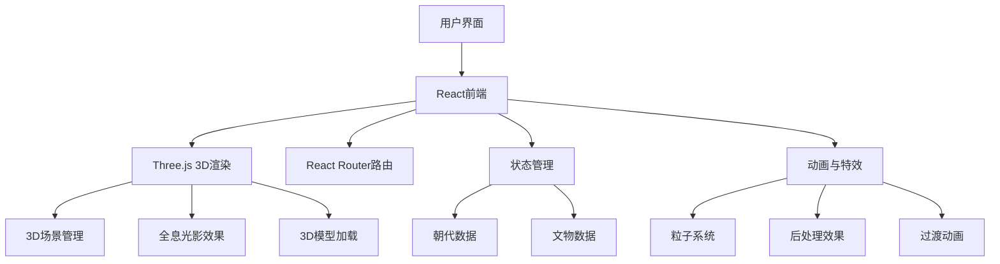
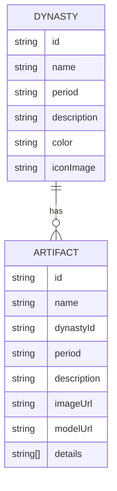

## 1. Architecture Design


## 2. Technology Description
- 前端：React@18 + TypeScript + Tailwind CSS@3 + Vite
- 3D渲染：Three.js + @react-three/fiber + @react-three/drei + @react-three/postprocessing
- 状态管理：Zustand
- 路由：React Router
- 动画：Framer Motion + CSS动画
- 构建工具：Vite

## 3. Route Definitions
| Route | Purpose |
|-------|---------|
| / | 首页 - 时间轴与朝代概览 |
| /dynasty/:id | 朝代详情页 - 3D文物展示 |
| /artifact/:id | 文物详情页 - 全息光影展示 |

## 4. Data Model
### 4.1 Data Model Definition


### 4.2 Data Definition
#### 朝代数据结构
```typescript
interface Dynasty {
  id: string;
  name: string;
  period: string;
  description: string;
  color: string;
  iconImage: string;
  startYear: number;
  endYear: number;
}
```

#### 文物数据结构
```typescript
interface Artifact {
  id: string;
  name: string;
  dynastyId: string;
  period: string;
  description: string;
  imageUrl: string;
  modelUrl?: string;
  details: string[];
  category: string;
  location: string;
}
```

## 5. 3D Implementation Details
### 5.1 首页3D效果
- 粒子背景效果
- 时间轴的动态光影
- 朝代卡片的3D悬浮动画

### 5.2 朝代详情页3D场景
- 全息光影环绕效果
- 文物卡片的网格布局
- 滚动时的视差效果

### 5.3 文物详情页3D场景
- 文物3D模型展示
- 360°旋转交互
- 全息光环和粒子环绕
- 细节点标注

## 6. 特效与动画策略
- 使用Framer Motion实现页面过渡动画
- 使用Three.js实现粒子系统和全息光影
- 使用CSS动画实现悬停和点击效果
- 使用@react-three/postprocessing实现辉光、景深等后处理效果

## 7. 性能优化策略
- 图片和3D模型的懒加载
- 根据设备性能动态调整特效复杂度
- 使用requestAnimationFrame优化动画
- 合理使用WebGL缓存和实例化
